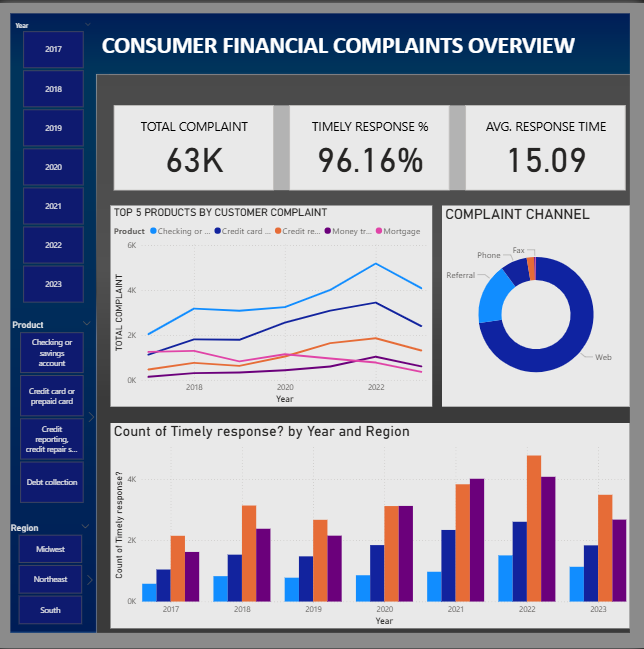
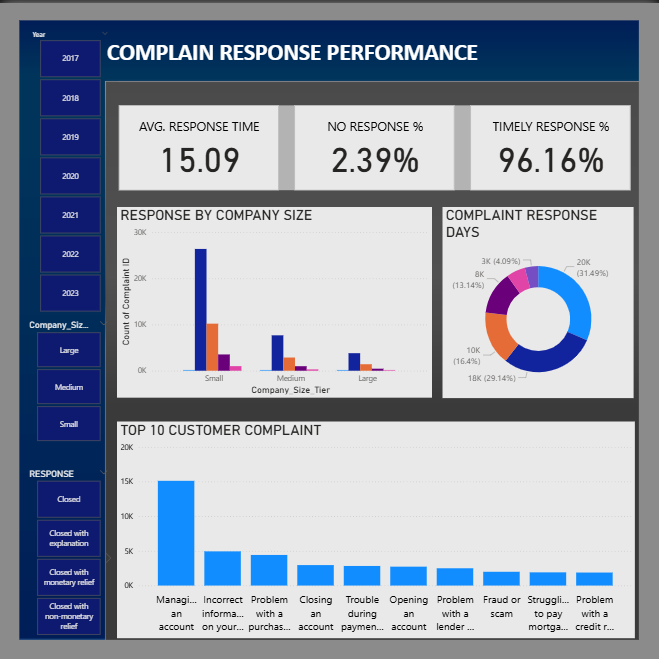
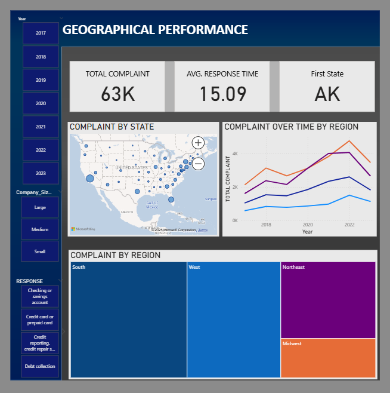

# Consumer Financial Complaint Analysis (Power BI)

This project analyzes consumer financial complaint data to uncover key insights on company performance, complaint trends, and regulatory implications.  
It was developed as part of the **DataDNA Challenge** which is my first time participating, and a major learning experience in building an end-to-end analytical dashboard using Power BI.

---

## 📊 Project Overview

The goal was to transform raw complaint data into actionable insights that can guide:
- **Regulators** in prioritizing supervision  
- **Companies** in improving response efficiency  
- **Consumers** in understanding service reliability  

---

## 🧩 Data Model

The data model consists of two key tables:
- **Fact Table:** Complaints (submission details, product, issue, company, dates)  
- **Dimension Table:** Company details (market share, size tier, reputation score)  

Relationships were built around **Company_ID** and **Date**, with a custom date table to support time intelligence.

---

## 📈 Dashboards

### 1. Consumer Financial Complaints Overview
Focus: Market-wide view of complaints across products and years.  

**Key visuals:**
- KPIs (Total Complaints, Timely Response %, Avg. Response Time)  
- Top 5 Products by Complaint Trend  
- Complaint Channel Distribution  
- Timely Response by Year and Region  

---

### 2. Complaint Response Performance
Focus: Company efficiency and response quality.  

**Key visuals:**
- Avg. Response Time, Timely Response %, No Response %  
- Response by Company Size  
- Complaint Response Days  
- Top 10 Customer Complaints (by Issue)  

---

### 3. Geographical Performance
Focus: Regional and state-level complaint distribution.  

**Key visuals:**
- Total Complaint, Avg. Response Time, First State  
- Complaint by State (Map)  
- Complaint Over Time by Region  
- Complaint by Region (Tree Map)  

---

## 🔍 Key Insights

- **Credit Reporting** remains the top driver of complaints.  
- **Manage an account** is the most common issue.  
- **West and South** regions have the highest complaint concentration.  
- **Small companies** show higher complaint density relative to size.  
- Timeliness is high (~96%), but **relief quality** remains inconsistent.  

---

## 🧠 Learnings

As my **first challenge project**, I learned how to:
- Design professional dashboards in Power BI  
- Create and link a date table for trend analysis  
- Use normalization metrics (e.g., complaints per market share)  
- Derive actionable insights for regulators and stakeholders  

---

## 📂 Files Included
- `Consumer_Complaint_Analysis.pbix` – Power BI report  
- `images/` – Containing images of the three dashboards  

---

## 🧭 Tools Used
- **Power BI** for data modeling and visualization  
- **Excel** for preprocessing  
- **Git & VS Code** for version control and documentation  

---

## 📬 Author
**Abraham Pelumi**  
DATA ANALYST||DATA SCIENTIST 
[LinkedIn](https://www.linkedin.com/in/abraham-pelumi-74a72494) | [GitHub](https://github.com/abplincoln)

Update README content

